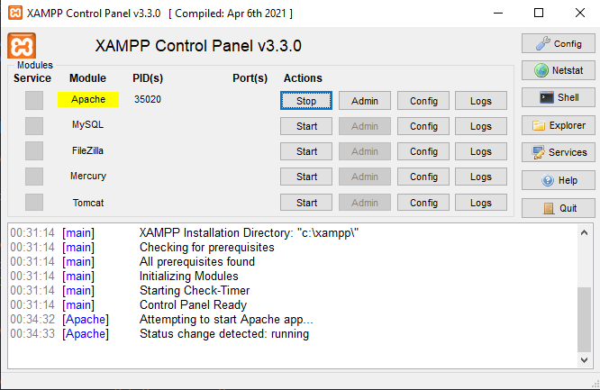
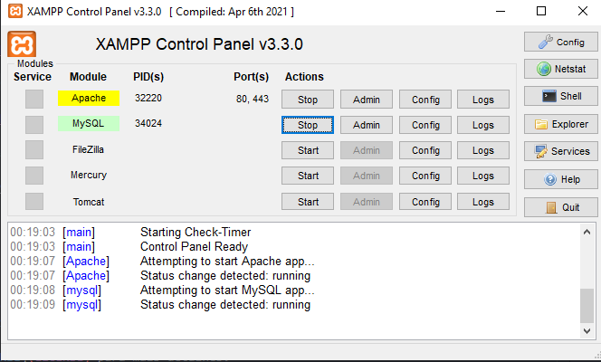

# 🥩 Churrascaria

O **Churrascaria** é uma **sistema WEB** desenvolvida para **fins acadêmicos**. Trata-se de uma **aplicação**, criada com o objetivo de praticar conceitos de desenvolvimento web junto com banco de dados e a criação de um CRUD.

---


## 📋 Sumário

- [Sobre o Projeto](#sobre-o-projeto)
- [Funcionalidades](#funcionalidades)
- [Tecnologias Utilizadas](#tecnologias-utilizadas)
- [Pré-requisitos](#pré-requisitos)
- [Como Executar o Projeto](#como-executar-o-projeto)
- [Licença](#licença)

---


## 📌 Sobre o Projeto

O **Churrascaria** é uma **Sistema de reserva e catálogos**. O foco do projeto está em **praticar a implementação do CRUD usando um banco de dados relacional**:

- PHP
- HTML5
- CSS3
- JavaScript ES6+
- MySQL

---


## 🚀 Funcionalidades

- 🌐 Interface limpa e responsiva;
- ⚙️ CRUD;
- 👨‍💻 Autenticação de usuário;
- ✉️ Envio de E-mail;
- 🚫 ACL (Controle de Acesso) dos usuários.

---


## 🧰 Tecnologias Utilizadas

- PHP
- HTML5
- CSS3
- JavaScript ES6+
- Bootstrap
- PHPMail
- MySQL
- JQuery

---


## ⚙️ Pré-requisitos

Certifique-se de ter instalado:

- [VSCode](https://code.visualstudio.com/).
- [XAMPP](https://www.apachefriends.org/pt_br/index.html).
- [Workbench](https://www.mysql.com/products/workbench/) - (Opcional).

---


## ▶️ Como Executar o Projeto

1. **Clone o repositório**

```bash
git clone https://github.com/maugois/Churrascaria.git
```
2. **Acesse a pasta do projeto**

```bash
cd C://xamp/htdocs/Churrascaria
```

3. **Ligue o servidor WEB do XAMPP**



3. **Ligue o banco de dados MySQL XAMPP**



4. **Rode o script do banco de dados**

- Acesse o phpMyAdmin no navegador: http://localhost/phpmyadmin;

- Crie um banco de dados com o nome: ti93phpdb01;

- Clique no banco de dados recém-criado e vá até a aba Importar;

- Clique em Escolher arquivo e selecione o arquivo **script.sql** que está na pasta database do projeto;

- Clique em Executar para importar o banco de dados.


5. **Acesse o projeto**

http://localhost/Churrascaria/index.php

---


## 📕 Licença

Este projeto está licenciado sob a Licença MIT. 
Veja o arquivo LICENSE para mais detalhes.

Veja o arquivo [LICENSE](LICENSE) para mais detalhes.   
